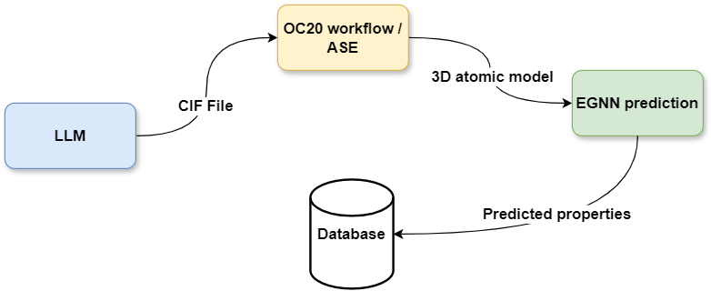

# Accelerating computational catalysis with GenAI and foundational models

<figure>
  
  <figcaption> System overview: The LLM generates a string representation of a bulk material, which is converted into a 3D atomic structure along with an adsorbate. This model is then processed by an EGNN for property prediction, and the results are stored in a database. </figcaption>
</figure>

## 🛠 Installation
Install dependencies from requirements.txt

Intall pytorch, torch_geometric and torch_scatter according to your specific setup: 
https://pytorch.org/
https://pytorch-geometric.readthedocs.io/en/latest/install/installation.html
https://pypi.org/project/torch-scatter/

## Models
EquiformerV2 trained model can be found [here](https://dl.fbaipublicfiles.com/opencatalystproject/models/2023_06/oc20/s2ef/eq2_153M_ec4_allmd.pt) 

Finetuned PEFT configuration for LLM can be found [here](https://huggingface.co/addisnae/demo), set model_path to "addisnae/demo" to use.

## Example usage
```
python src/pkg/main.py --model_name=7b --model_path=path/to/model/checkpoint --adsorbate=N2 --out_path=path/to/output/folder
```
## Required arguments:
|   Argument | Explanation |
| ---------: | :----------------------- |
|  `--model_name`  | Specify which llama 2 model to use, for example "7b" or "70b-chat" |
| `--model_path`  | Specify path to fine-tuned weights, can use "addisnae/demo" for pre made PEFT configuration |
| `--adsorbate` | Which adsorbate to use in string format, for example "H2" |
| `--out_path` | Output path, all databases, CIF, and trajectory files will be stored under this directory |

## Optional arguments:
|   Argument | Explanation |
| ---------: | :----------------------- |
| `--surface_site_sampling_mode` | Choose how adsorption sites are chosen. "random", "heuristic" or "random_site_heuristic_placement"  |
| `--ml_model_checkpoint` | Specify the ML model checkpoint to use for property prediction  |
|   `--num_samples` | Number of samples/catalysts the llm will generate  |
|  `--batch_size` |  Batch size of LLM  |
| `--samples_file` | use a csv file containing samples/catalysts instead of generating them  |
|   `--temperature`  | temperature of LLM |
|  `--top_p`  | top_p of LLM |
|  `--instruction_prompt`  | Instruction promp for LLM material generation, for example "The chemical formula is PtRu" |